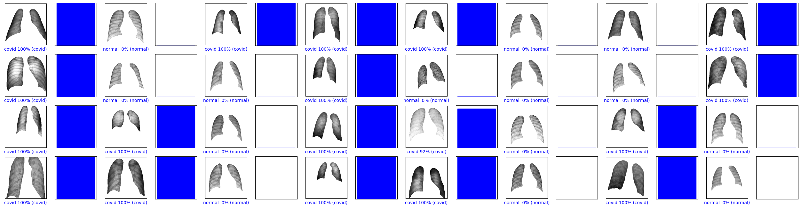
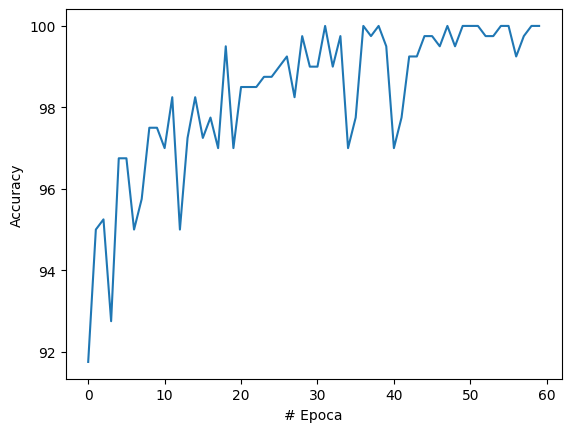
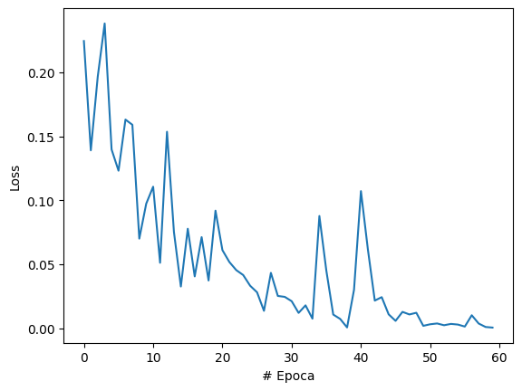
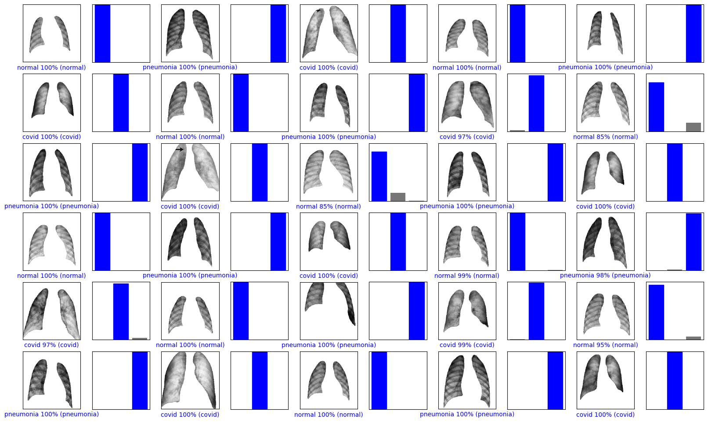
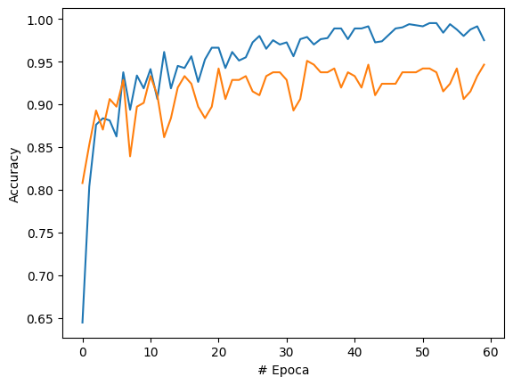
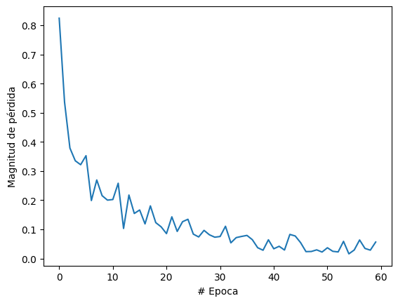

# Descripción
Este repositorio contiene la implementación de trabajos prácticos para la asignatura "Inteligencia Computacional" de la carrera Ingeniería en Sistemas (Universidad Tecnológica Nacional, Facultad Regional Santa Fe). 

# Autores
* Matías Storti
* Mateo Toniolo
* Fidel Dalmasso

# TP1 Detección de COVID-19 a partir de imágenes de rayos X con Redes Neuronales de Convolución
Este trabajo tiene como objetivo comprender el uso y funcionamiento de redes neuronales, a través de la implementación de un trabajo previamente realizado y publicado en el ámbito de investigación científica. En este caso se seleccionó el trabajo [“Detección de COVID-19 y otros casos de Neumonía usando Redes Neuronales Convolucionales e Imágenes de Rayos X”](https://doi.org/10.15446/ing.investig.v42n1.90289) de Carlos Eduardo Belman-López, que tiene como objetivo presentar nuevos modelos para detectar COVID-19 y otros casos de neumonía utilizando imágenes de rayos-X y redes neuronales, proporcionando diagnósticos precisos para escenarios de clasificación binaria (Covid/No-Covid) y categórica (Covid/Normal/Neumonía bacteriana/Neumonía viral).

## Screenshots
### Modelo binario
<p float="center">

</p>
<p float="center">


</p>

### Modelo categórico
<p float="center">

</p>
<p float="center">


</p>

## Cómo ejecutar
Crear y activar entorno de conda (o bien usar venv)
```
conda create -n ic python=3.10
conda activate ic
```
Instalar dependencias
```
pip install -r requirements.txt
```
Usar VSC para correr el notebook. Para que use el entorno de conda, es necesario cambiar el intérprete que usa VSC. Para ello desde VSC: 

```Ctrl+P > Python:Select Interpreter > Python 3.10.4 ('ic')```
